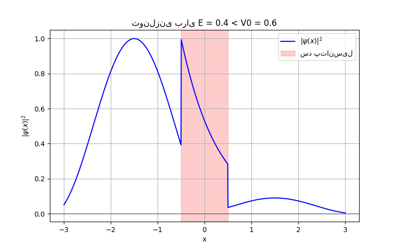

# Simple 1D Quantum Tunneling Visualiser

A small educational Python script to draw a toy picture of quantum tunneling through a one-dimensional rectangular potential barrier.
This repository contains a simple plotting script (based on `numpy` + `matplotlib`) that visualises the spatial behaviour of the wave (or its probability density $|\psi(x)|^2$) for a chosen energy $E$ and a rectangular barrier of height $V_0$ and width $a$.

---

## What this project shows

* A sketch / plot of $|\psi(x)|^2$ in three regions:

  * **Left (incoming + reflected)**: oscillatory wave.
  * **Barrier region**: decaying (evanescent) solution when $E<V_0$.
  * **Right (transmitted)**: transmitted oscillatory wave (smaller amplitude).
* How the probability inside the barrier decays and how the transmitted amplitude depends on barrier parameters.

> **Important (physics):** classically a particle needs $E\ge V_0$ to pass the barrier. Quantum mechanically, for $E<V_0$ there is still a nonzero probability of transmission (tunneling). There is **no strict minimum energy** for tunneling: even arbitrarily small $E$ gives a nonzero (but possibly astronomically small) transmission probability. In practice, one can define a *practical* threshold $T \ge T_\text{min}$ and determine the minimum energy that gives that probability.

---

## Dependencies

```bash
pip install numpy matplotlib
```

---

## How to run

```bash
python tunneling.py
```

The script will display a plot of $|\psi(x)|^2$ and shade the barrier region.


---

## Mathematics — rectangular potential barrier (complete)

We summarize the standard time-independent analysis and give the closed form for the transmission probability $T$.

### 1. Setup — Schrödinger equation

One-dimensional time-independent Schrödinger equation:

$$
-\frac{\hbar^2}{2m}\frac{d^2\psi}{dx^2} + V(x)\psi = E\psi.
$$

Rectangular barrier (common convenient labelling):

$$
V(x)=
\begin{cases}
0, & x<0 \quad(\text{Region I})\\[6pt]
V_0, & 0\le x\le a \quad(\text{Region II})\\[6pt]
0, & x>a \quad(\text{Region III})
\end{cases}
$$

We look for a wave coming from the left (Region I), so the general solutions are:

* Region I $(x<0)$:

  $$
  \psi_I(x) = A e^{ikx} + B e^{-ikx},\qquad k=\frac{\sqrt{2mE}}{\hbar}.
  $$

  $A$ is the amplitude of the right-going incident wave, $B$ the reflected amplitude.

* Region II $(0\le x\le a)$:

  * If $E < V_0$ (tunneling case), set

    $$
    \kappa = \frac{\sqrt{2m(V_0-E)}}{\hbar},\qquad
    \psi_{II}(x)=C e^{\kappa x} + D e^{-\kappa x}.
    $$

    (Both exponentials are allowed because the region is finite.)
  * If $E > V_0$ (classically allowed inside), set

    $$
    q = \frac{\sqrt{2m(E-V_0)}}{\hbar},\qquad
    \psi_{II}(x)=C e^{i q x} + D e^{-i q x}.
    $$

* Region III $(x>a)$: only transmitted right-going wave:

  $$
  \psi_{III}(x)=F e^{ikx}.
  $$

We want the transmission probability $T = \dfrac{\text{transmitted flux}}{\text{incident flux}} = \dfrac{|F|^2}{|A|^2}$ (for identical masses/leads this reduces to amplitude ratio squared times a velocity factor, but here symmetric leads give $T=|F/A|^2$ after including group-velocity ratio).

### 2. Boundary conditions

Impose continuity of $\psi$ and $\psi'$ at $x=0$ and $x=a$:

At $x=0$:

$$
A + B = C + D, \qquad
ik(A - B) = \gamma (C - D),
$$

where $\gamma=\kappa$ (if $E<V_0$) or $\gamma = i q$ (if $E>V_0$).

At $x=a$:

$$
C e^{\gamma a} + D e^{-\gamma a} = F e^{i k a}, \qquad
\gamma\bigl(C e^{\gamma a} - D e^{-\gamma a}\bigr) = i k F e^{i k a}.
$$

Solving the linear system (eliminating $B, C, D$) yields a closed form for the transmitted amplitude $t\equiv F/A$. After algebraic simplification we get the following compact forms for the transmission probability $T=|t|^2$.

### 3. Transmission probability — final formulas

Define

$$
k=\frac{\sqrt{2mE}}{\hbar},\qquad
\text{and}
\quad
\begin{cases}
\kappa=\dfrac{\sqrt{2m(V_0-E)}}{\hbar}, & E<V_0\\[6pt]
q=\dfrac{\sqrt{2m(E-V_0)}}{\hbar}, & E>V_0
\end{cases}
$$

**(a) For $E<V_0$ (tunneling, evanescent region inside):**

$$
\boxed{ \displaystyle
T(E) \;=\; \left[ 1 + \frac{V_0^2}{4 E (V_0 - E)}\; \sinh^2(\kappa a) \right]^{-1}
}
$$

This is equivalent to the form using $k$ and $\kappa$:

$$
T(E) = \left[ 1 + \frac{(k^2+\kappa^2)^2}{4 k^2 \kappa^2}\; \sinh^2(\kappa a) \right]^{-1}.
$$

**(b) For $E>V_0$ (classically allowed inside):**

$$
\boxed{ \displaystyle
T(E) \;=\; \left[ 1 + \frac{V_0^2}{4 E (E - V_0)}\; \sin^2(q a) \right]^{-1}
}
$$

or equivalently

$$
T(E) = \left[ 1 + \frac{(k^2 - q^2)^2}{4k^2 q^2}\; \sin^2(q a) \right]^{-1}.
$$

**Reflection:** for lossless, 1D barrier, $R(E) = 1 - T(E)$.

### 4. Opaque barrier (large $\kappa a$) approximation

When the barrier is thick and/or high so that $\kappa a \gg 1$, $\sinh(\kappa a)\approx \tfrac12 e^{\kappa a}$. Then

$$
T(E) \approx \frac{16\,E (V_0 - E)}{V_0^2}\, e^{-2\kappa a}.
$$

This exhibits the characteristic **exponential suppression** of tunneling probability with barrier thickness and square-root dependence via $\kappa$.

### 5. Does tunneling have a minimum energy?

Strictly quantum mechanically: **no** — for a finite barrier there is nonzero transmission for any $E>0$ (assuming the leads are free). However, the tunneling probability can be astronomically small for small $E$. Practically one picks a threshold $T_\text{min}$ (e.g. $10^{-6}$, $10^{-3}$) and defines the *practical minimum energy* as the smallest $E$ for which $T(E)\ge T_\text{min}$.

---

## Notes on units

* The derivation uses physical constants $\hbar$ and $m$. Your simple plotting script sets `hbar = 1` and `m = 1` (naturalised / dimensionless units). That is fine for qualitative visualisation. If you want to use SI units, set

  $$
  \hbar \approx 1.054571817\times 10^{-34}\ \mathrm{J\cdot s},\quad
  m = 9.10938356\times 10^{-31}\ \mathrm{kg},
  $$

  and convert lengths/energies consistently (e.g., length in meters, energy in joules or use eV and convert $\hbar$ accordingly).

---

## Limitations & disclaimers

* The plotting script included in this repo is intentionally **simplified** and **illustrative** (not a full numerical solution of the time-dependent Schrödinger equation).
* The interior waveform approximations are for demonstration, not for high-precision scattering amplitudes. Use the exact T(E) formula above to compute transmission probabilities.
* If you want a fully dynamical, visual, and quantitative simulation, consider:

  * solving the time-dependent Schrödinger equation (Crank–Nicolson or split-step) for a wave-packet, OR
  * using a transfer-matrix numeric implementation on a sufficiently fine spatial mesh.

---

## References / further reading

* D. J. Griffiths, *Introduction to Quantum Mechanics*
* Stephen Gasiorowicz, *Quantum Physics*